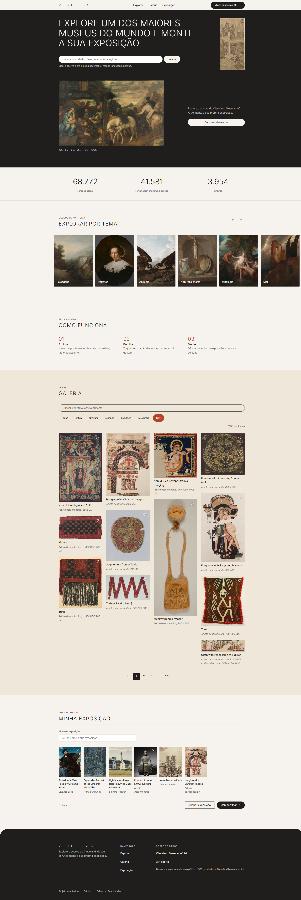

# Vernissage

Um painel interativo em React que transforma o acervo aberto do Cleveland Museum of Art em uma curadoria pessoal.

Vernissage é a palavra francesa para a noite de abertura de uma exposição, o momento em que as obras são reveladas ao público pela primeira vez. O nome resume a proposta do projeto: cada visitante monta a própria mostra a partir do acervo do museu e vive a sua própria noite de abertura.

**Aplicação publicada:** _(https://vernissage-museum.vercel.app)_
**Repositório:** https://github.com/matheusdias20/vernissage




## Problemática

O acervo do Cleveland Museum of Art tem mais de 40 mil obras com imagem em domínio público, mas isso sozinho não ajuda quem não sabe o que procurar. Buscar exige já conhecer um artista, um título ou um movimento, e quem não tem esse repertório não sabe por onde começar.

## Objetivo

Transformar a exploração desse acervo em curadoria. Em vez de só listar obras, o Vernissage guia o visitante por temas (paisagens, retratos, animais, natureza-morta, mitologia e mar), permite buscar e filtrar por tipo de obra, mostra a ficha completa de cada peça e deixa o visitante montar a própria exposição, com título e obras salvas no navegador.

**Usuário:** estudante ou curioso que gosta de arte, mas não tem repertório para buscar por nome.

## Tecnologias utilizadas

- React 19 com Vite 8
- JavaScript, sem TypeScript
- CSS Modules, com variáveis globais para cor, tipografia e espaçamento
- ESLint, com as regras de hooks do React
- Context API para o estado da exposição, com persistência em localStorage
- Vercel para o deploy

Não há bibliotecas de UI, de estado ou de requisição. As chamadas usam fetch nativo.

## API utilizada

[Cleveland Museum of Art Open Access API](https://openaccess-api.clevelandart.org/), sem necessidade de chave. O acervo é aberto e as imagens podem ser carregadas livremente em outros sites.

Pontos importantes sobre o uso dessa API:
- Os dados e as imagens usadas no site são de obras em domínio público (CC0).
- O parâmetro de busca de texto (`q`) só filtra de fato quando combinado com uma consulta `multi_match` dentro da query, e não sozinho.
- As URLs de listagem precisam terminar com uma barra antes da query string, senão a resposta vem sem o cabeçalho de CORS e o navegador bloqueia a leitura.

## Principais funcionalidades

- Busca por artista, título ou assunto, com pausa na digitação antes de buscar
- Seis temas de exploração guiada (paisagens, retratos, animais, natureza-morta, mitologia e mar)
- Filtro por tipo de obra (pintura, gravura, desenho, escultura, fotografia e têxtil)
- Ficha de detalhes de cada obra, com imagem, artista, data, técnica, dimensões, origem e descrição
- Exposição pessoal: favoritar obras, dar um título à exposição e ver tudo reunido, salvo no navegador
- Paginação numerada no computador e "carregar mais" no celular
- Estados tratados em toda a aplicação: carregando, erro com nova tentativa, sem resultados e obra sem imagem
- Layout responsivo, do celular ao desktop

## Estrutura de pastas

```
src/
├── components/
│   ├── layout/      Header, Footer
│   ├── sections/    Hero, StatsStrip, ThemeCarousel, ThemeCard, StepsList, Gallery, ExhibitionPanel
│   ├── artwork/     ArtworkGrid, ArtworkCard, ArtworkModal
│   ├── filters/     SearchBar, Filters
│   └── ui/          SectionHeader, Button, Chip, Pagination, Loading, EmptyState, ErrorMessage
├── context/         estado da exposição (ExhibitionContext)
├── hooks/           useArtworks, useArtworkDetails, useStats, useExhibition, useDebounce, useMediaQuery
├── services/        artApi.js (toda a comunicação com a API)
├── utils/           formatters.js, stripHtml.js
├── constants/       themes.js, artworkTypes.js
├── styles/          variables.css, reset.css, global.css
├── App.jsx
└── main.jsx
```

## Como executar o projeto

Pré-requisito: Node 20.19 ou superior.

```bash
git clone https://github.com/matheusdias20/vernissage.git
cd vernissage
npm install
npm run dev
```

A aplicação abre em `http://localhost:5173`. Para gerar a versão de produção:

```bash
npm run build
npm run preview
```

Não é preciso configurar nenhuma chave de API nem variável de ambiente.

## Uso de Inteligência Artificial

Utilizei o Claude como apoio durante todo o desenvolvimento, sempre revisando o que era gerado antes de aceitar.

### Prompt utilizado

"Implemente a camada de dados do Vernissage, que conecta o projeto à API do Cleveland Museum of Art. As alterações ficam em src/services/artApi.js, src/utils/formatters.js, src/constants/artworkTypes.js, os hooks de dados e o contexto da exposição. Depois de implementar, crie temporariamente um script que consulte a API e confira os totais esperados para cada busca e filtro, mostre um resumo e apague o script."

### Objetivo do prompt

Usei esse prompt para construir a camada que conecta o Vernissage à API do Cleveland Museum of Art: as funções de busca, filtro e detalhe de obras, os textos formatados para exibição e o estado da exposição. Pedi também que a própria IA conferisse os números reais da API (totais de busca, de tipo e de tema) antes de eu confiar no resultado, em vez de aceitar o código sem checar se os dados batiam.
